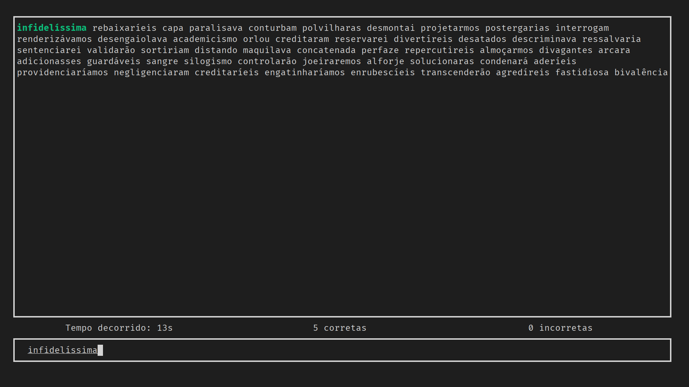

# Teste de digitação
Esse é um ferramenta CLI feito com Rust e Ratatui para teste de digitação ou mesmo treino de digitação.

Conta com uma interface amigável com preview de 50 palavras, sendo a primeira destacada com cores a medida que o usuário digita.
<br>
Cada letra digitada tem uma cor, sendo verde caso tenha digitado corretamente, e vermelho caso tenha digitado errado..

Conta com mais de 260 mil palavras da língua portuguesa.

### Como usar
Ao digitar uma palavra, você conclui e passa para a próxima usando a tecla de espaço.

Para concluir o teste aperte Enter para mostrar o sumário, ou esc para simplesmente sair.

Pode ser executado com o comando:
```
cargo run -q release
``````

### Preview



### Dependencias 
- [crossterm](https://crates.io/crates/crossterm) -  A crossplatform terminal library for manipulating terminals. 
- [rand](https://crates.io/crates/rand) -  A crossplatform terminal library for manipulating terminals. 
- [ratatui](https://crates.io/crates/ratatui) -  A library that's all about cooking up terminal user interfaces 
- [tui-textarea](https://crates.io/crates/tui-textarea) -  tui-textarea is a simple yet powerful text editor widget for ratatui and tui-rs.